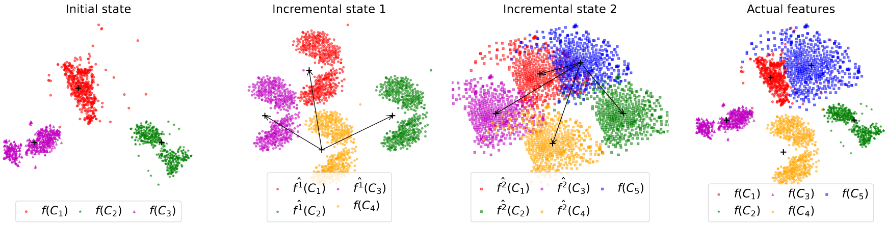

# FeTrIL
This is the official code for [FeTrIL](https://gregoirepetit.github.io/projects/FeTrIL) (WACV2023): Feature Translation for Exemplar-Free Class-Incremental Learning

<p align="center">

</p>

## Abstract

Exemplar-free class-incremental learning is very challenging due to the negative effect of catastrophic forgetting. A balance between stability and plasticity of the incremental process is needed in order to obtain good accuracy for past as well as new classes. Existing exemplar-free class-incremental methods focus either on successive fine tuning of the model, thus favoring plasticity, or on using a feature extractor fixed after the initial incremental state, thus favoring stability. We introduce a method which combines a fixed feature extractor and a pseudo-features generator to improve the stability-plasticity balance. The generator uses a simple yet effective geometric translation of new class features to create representations of past classes, made of pseudo-features. The translation of features only requires the storage of the centroid representations of past classes to produce their pseudo-features. Actual features of new classes and pseudo-features of past classes are fed into a linear classifier which is trained incrementally to discriminate between all classes. The incremental process is much faster with the proposed method compared to mainstream ones which update the entire deep model. Experiments are performed with three challenging datasets, and different incremental settings. A comparison with ten existing methods shows that our method outperforms the others in most cases.

## Installation

### Environment

To install the required packages, please run the following command (conda is required), using [fetril.yml](fetril.yml) file:

```bash
conda env create -f fetril.yml
```

If the installation fails, please try to install the packages manually with the following command:

```bash
conda create -n fetril python=3.7
conda activate fetril
conda install pytorch torchvision torchaudio pytorch-cuda=11.6 -c pytorch -c nvidia
pip install typing-extensions --upgrade
conda install pandas
pip install -U scikit-learn scipy matplotlib
```

### Dependencies

The code depends on the repository [utilsCIL](https://github.com/GregoirePetit/utilsCIL) which contains the code for the datasets and the incremental learning process. Please clone the repository on your home ([FeTrIL code](https://github.com/GregoirePetit/FeTrIL/blob/main/codes/scratch.py#L19) will find it) or add it to your PYTHONPATH:

```bash
git clone git@github.com:GregoirePetit/utilsCIL.git
```

## Usage

### Configuration

Using the [configs/cifar100_b50_t10.cf](https://github.com/GregoirePetit/FeTrIL/blob/main/configs/cifar100_b50_t10.cf) file, you can prepare your experiment. You can change the following parameters:
- `nb_classes`: number of classes in the dataset
- `dataset`: name of the dataset (for exemple: cifar100, tinyimagenet, etc.)
- `first_batch_size`: number of classes in the first state
- `il_states`: number of incremental states (note that the first state is not counted as incremental)
- `random_seed`: random seed for the experiment (default: -1 will not shuffle the class order)
- `num_workers`: number of workers for the dataloader
- `regul`: regularization parameter for the classifier
- `toler`: tolerance parameter for the classifier
- `epochs_lucir`: number of epochs for the LUCIR part of the training
- `epochs_augmix_ft`: number of epochs for the AugMix fine-tuning part of the training
- `list_root`: path to the directory where the lists of images and classes are stored
- `model_root:`: path to the directory where the models will be saved
- `feat_root`: path to the directory where the features will be saved
- `classifiers_root`: path to the directory where the classifiers will be saved
- `pred_root`: path to the directory where the predictions will be saved
- `mean_std`: path to the file containing the mean and std of the dataset

### Experiments

Once the configuration file is ready, you can run the following command to launch the experiment:

#### Compute the pseudo-features according to the FeTrIL method:
```bash
python codes/compute_distances.py configs/cifar100_b50_t10.cf
```

#### Format the pseudo-features to be used by the dataloader:
```bash
python codes/prepare_train.py configs/cifar100_b50_t10.cf
```

#### Train the classifiers:
```bash
python codes/train_classifiers.py configs/cifar100_b50_t10.cf
```

#### Clean the pseudo-features used by the dataloader to train the classifiers:
```bash
python codes/clean_train.py configs/cifar100_b50_t10.cf
```

#### Compute the predictions on the test set:
```bash
python codes/compute_predictions.py configs/cifar100_b50_t10.cf
```

#### Compute the accuracy on the test set:
```bash
python codes/eval.py configs/cifar100_b50_t10.cf
```

## Citation
If you find this code useful for your research, please cite our paper:

```BibTeX
@article{petit2023fetril, 
 Title = {FeTrIL: Feature Translation for Exemplar-Free Class-Incremental Learning}, 
 Author = {G. Petit, A. Popescu, H. Schindler, D. Picard, B. Delezoide}, 
 Journal = {Winter Conference on Applications of Computer Vision (WACV)}, 
 Year = {2023}
}
```
